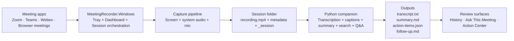

<a id="top"></a>

# Meeting Recorder


> [!IMPORTANT]
> **Status: beta.** The Windows dashboard, capture flow, captions path, history, action center, and processing pipeline are in the repo today. Reliability and polish are still being hardened across Zoom, Teams, Webex, and browser meetings.

<p align="center">
  <a href="#why-this-exists">Why this exists</a> &bull;
  <a href="#product-tour">Product tour</a> &bull;
  <a href="#what-you-get">Features</a> &bull;
  <a href="#architecture">Architecture</a> &bull;
  <a href="#quick-start">Quick start</a> &bull;
  <a href="#scripts-youll-actually-use">Scripts</a> &bull;
  <a href="#session-output">Session output</a> &bull;
  <a href="#troubleshooting">Troubleshooting</a>
</p>

---

## Why This Exists

Most meeting tools solve only one layer of the workflow:

- recording without useful outputs
- captions without memory
- notes without evidence
- summaries without follow-through

Meeting Recorder is designed to close that loop in one Windows desktop flow:

1. Start a recording from one app.
2. Capture screen and/or audio.
3. Show live captions while the session runs.
4. Generate transcript, summary, action items, and follow-up after stop.
5. Search old meetings and ask grounded questions later.

This repo is **Windows-first** now. The browser extension remains in the repository as a legacy/helper path, but the main product surface is the Windows dashboard and tray app.

<p align="right"><a href="#top">back to top</a></p>

---

## Product Tour

<p align="center">
  
</p>

> The studio dashboard shows live captions, sidebar navigation, recording controls, and capture configuration in a single unified view. Switch between **Live Captions**, **Meeting History**, and **Action Center** from the sidebar.

<p align="right"><a href="#top">back to top</a></p>

---

## What You Get

| | Area | Included today |
|---|---|---|
| :desktop_computer: | **Windows UX** | Tray app, single dashboard, pop-out captions, meeting history, action center |
| :studio_microphone: | **Recording modes** | `Screen + audio`, `Audio only` |
| :dart: | **Capture targets** | Full screen, selected display, selected window |
| :memo: | **Live review** | In-app live captions with retained history |
| :gear: | **Post-processing** | Transcript, summary, action items, follow-up draft |
| :mag: | **Search and recall** | Meeting history and `Ask This Meeting` |
| :robot: | **AI provider** | OpenAI-backed summaries and Q&A with local fallback behavior |
| :floppy_disk: | **Storage** | Local meeting folders under `Documents\Meetings` |
| :wrench: | **Recovery** | Batch repair for sessions whose final audio mix failed |

<p align="right"><a href="#top">back to top</a></p>

---

## Current Reality

### Working now

- Windows-first dashboard and tray workflow
- manual recording even when meeting detection is not active
- session capture switching in the in-process path
- live captions with retained history
- processed local session outputs
- searchable history and follow-up views
- OpenAI-backed summary and meeting Q&A when configured
- repair path for older recordings with broken mic/system mixes

### Still being hardened

> [!NOTE]
> These areas have shipped paths in the app but are not yet fully reliable across all scenarios.

- capture reliability across every Zoom, Teams, Webex, and browser scenario
- truly realtime captions
- named speaker quality across native apps
- desktop resizing/layout polish across all monitor and DPI combinations
- deeper transcript grounding for every `Ask This Meeting` answer

<p align="right"><a href="#top">back to top</a></p>

---

## Support Snapshot

| Capability | Google Meet in Chrome/Edge | Teams desktop | Zoom desktop | Webex desktop |
| --- | --- | --- | --- | --- |
| Meeting detection | Beta | Beta | Beta | Beta |
| `Audio only` recording | Better path today | Beta | Beta | Beta |
| `Screen + audio` recording | Beta | Beta | Beta | Beta |
| Switch target mid-session | Beta | Beta | Beta | Beta |
| Live captions | Beta | Partial | Partial | Partial |
| Named participants | Partial | Partial | Partial | Partial |
| History + Ask | Available after processing | Available after processing | Available after processing | Available after processing |

> [!NOTE]
> **Beta** means there is a shipped path in the app, but it still needs more hardening.
> **Partial** means a path exists, but it is not reliable enough yet to treat as fully solved.

<p align="right"><a href="#top">back to top</a></p>

---

## Architecture



<p align="right"><a href="#top">back to top</a></p>

---

## Quick Start

### Requirements

- Windows 11
- .NET 10 SDK
- Python 3.11+
- `ffmpeg.exe` on `PATH` or at `companion\bin\ffmpeg\ffmpeg.exe`

> [!TIP]
> **Recommended extras:**
> - a local virtual environment under `.venv`
> - `OPENAI_API_KEY` for better summaries and Q&A
> - `faster-whisper` for local transcription

### Configuration model

- [`meeting-recorder.config.json`](meeting-recorder.config.json)
  Shared runtime behavior for the Windows app and Python companion.
- [`.env.example`](.env.example)
  Safe template for local secrets and machine-specific overrides.

### Step 1 — Create the Python environment

```powershell
python -m venv .venv
.\.venv\Scripts\Activate.ps1
pip install -r .\companion\requirements.txt
```

### Step 2 — Create your local secret file

```powershell
Copy-Item .env.example .env
```

Then set at least:

```env
OPENAI_API_KEY=your_key_here
MEETING_COMPANION_SUMMARY_PROVIDER=openai
OPENAI_MODEL=gpt-5-mini
```

> [!WARNING]
> Do not commit your `.env` file. Use [`.env.example`](.env.example) as the safe template instead.

### Step 3 — Build

```powershell
.\scripts\build_windows_shell.ps1
```

### Step 4 — Run

Fast path:

```powershell
.\scripts\start_windows_recorder_fast.ps1
```

Rebuild and relaunch:

```powershell
.\scripts\start_windows_recorder_fast.ps1 -Rebuild
```

Or use:

```text
Run-MeetingRecorder.cmd
```

<p align="right"><a href="#top">back to top</a></p>

---

## In-App Workflow

1. Launch the recorder dashboard.
2. Choose `Screen + audio` or `Audio only`.
3. Choose full screen or a window target.
4. Use `Pick screen` or `Pick window` if needed.
5. Click `Start`.
6. Use `Pause`, `Resume`, `Stop`, `History`, `Action Center`, or pop-out captions from the same app.
7. After stop, review the processed session from Meeting History or the Action Center.

<p align="right"><a href="#top">back to top</a></p>

---

## Session Output

Sessions are stored under:

```text
Documents\Meetings\YYYY-MM-DD\<session-folder>
```

Top-level files are the user-facing outputs:

```text
metadata.json
recording.mp4
transcript.txt
summary.md
action-items.json
follow-up.md
```

<details>
<summary><strong>Internal runtime artifacts</strong></summary>

Internal runtime artifacts are grouped under:

```text
<session-folder>\_session
```

Typical internal files include:

```text
capture.json
app.log
processing.log
live-captions-worker.log
system-audio.wav
mic.wav
mixed-audio.wav
transcript.json
speaker-diarization.json
live-captions.json
live-captions.txt
native-captions.json
participants.json
```

</details>

<p align="right"><a href="#top">back to top</a></p>

---

## Scripts You'll Actually Use

| Script | Purpose |
| --- | --- |
| [build_windows_shell.ps1](scripts/build_windows_shell.ps1) | Build the Windows projects safely |
| [start_windows_recorder_fast.ps1](scripts/start_windows_recorder_fast.ps1) | Fast launch or rebuild-and-launch |
| [process_latest_meeting.ps1](scripts/process_latest_meeting.ps1) | Re-run processing for the latest meeting |
| [repair_failed_audio_mix.ps1](scripts/repair_failed_audio_mix.ps1) | Repair old sessions where the final mic/system mix failed |

### Repair old recordings

Repair all known failed sessions:

```powershell
.\scripts\repair_failed_audio_mix.ps1 -AllFailed
```

Repair one meeting folder directly:

```powershell
.\scripts\repair_failed_audio_mix.ps1 -SessionDir "C:\Users\you\Documents\Meetings\2026-04-01\some-session"
```

<p align="right"><a href="#top">back to top</a></p>

---

## Logs

<details>
<summary><strong>Log file locations</strong></summary>

App-level logs:

- `Documents\Meetings\logs\python-companion.log`
- `Documents\Meetings\logs\dotnet-recorder.log`
- `Documents\Meetings\logs\dotnet-startup-trace.log`
- `Documents\Meetings\logs\dotnet-startup-error.log`

Per-meeting logs:

- `<session-folder>\_session\app.log`
- `<session-folder>\_session\processing.log`
- `<session-folder>\_session\live-captions-worker.log`

> [!NOTE]
> If `Documents\Meetings` is not writable in a sandboxed run, logs fall back under repo-local `meetings-data\logs`.

</details>

<p align="right"><a href="#top">back to top</a></p>

---

## Troubleshooting

> [!TIP]
> Start by checking the relevant log files in the [Logs](#logs) section above.

<details>
<summary><strong>The dashboard does not appear</strong></summary>

- run `.\scripts\start_windows_recorder_fast.ps1 -Rebuild`
- check `Documents\Meetings\logs\dotnet-startup-error.log`
- check `Documents\Meetings\logs\dotnet-startup-trace.log`

</details>

<details>
<summary><strong>My voice is missing from the final video</strong></summary>

- check whether `[meeting]\_session\mic.wav` exists and has real size
- if the session is older and the final mix failed, run:

```powershell
.\scripts\repair_failed_audio_mix.ps1 -AllFailed
```

</details>

<details>
<summary><strong>Transcript or summary is missing</strong></summary>

- make sure the meeting actually captured audio
- confirm `faster-whisper` is installed if you want local transcription
- rerun processing:

```powershell
.\scripts\process_latest_meeting.ps1
```

</details>

<details>
<summary><strong>Live captions feel delayed</strong></summary>

- this path is still near-realtime, not true streaming ASR yet
- cleaner audio and smaller models help
- browser/native caption feeds can improve quality when available

</details>

<p align="right"><a href="#top">back to top</a></p>

---

## Repository Layout

<details>
<summary><strong>Repository structure</strong></summary>

```text
Codex/
├── windows-shell/                # .NET — tray, dashboard, capture, session orchestration
│   ├── MeetingRecorder.Windows/
│   ├── MeetingRecorder.CaptureWorker/
│   └── MeetingRecorder.Shared/
├── companion/                    # Python — transcription, summaries, captions, Q&A
│   ├── meeting_companion/
│   ├── tests/
│   └── bin/
├── browser-extension/            # Legacy helper path (optional)
│   ├── src/
│   └── tests/
├── scripts/                      # Build, launch, repair, recovery helpers
├── docs/assets/                  # README visuals and UI preview SVGs
├── meeting-recorder.config.json
├── .env.example
└── README.md
```

</details>

<p align="right"><a href="#top">back to top</a></p>

---

## Testing

<details>
<summary><strong>Test commands</strong></summary>

Python tests:

```powershell
python -m unittest discover -s companion\tests -p "test_*.py"
```

Windows build:

```powershell
.\scripts\build_windows_shell.ps1
```

Browser adapter tests:

```powershell
node browser-extension\tests\adapters.test.js
```

</details>

<p align="right"><a href="#top">back to top</a></p>

---

## Near-Term Priorities

- [ ] Harden screen + audio capture across all meeting tools
- [ ] Reduce live-caption latency
- [ ] Improve speaker attribution and named-caption coverage
- [ ] Make `Ask This Meeting` more transcript-grounded
- [ ] Keep the Windows-first product path independent from the browser extension

<p align="right"><a href="#top">back to top</a></p>

---

## Notes

> [!CAUTION]
> Do not commit a live [`.env`](.env) file. Use [`.env.example`](.env.example) instead.

- this repo has a real Windows product path, not only a browser prototype
- the browser extension is optional for the main Windows-first workflow

<p align="right"><a href="#top">back to top</a></p>

---

<p align="center">
  <sub>Built for Windows 11 with WinForms, Python, and OpenAI.</sub><br/>
  <sub>Meeting Recorder is a private project.</sub>
</p>
