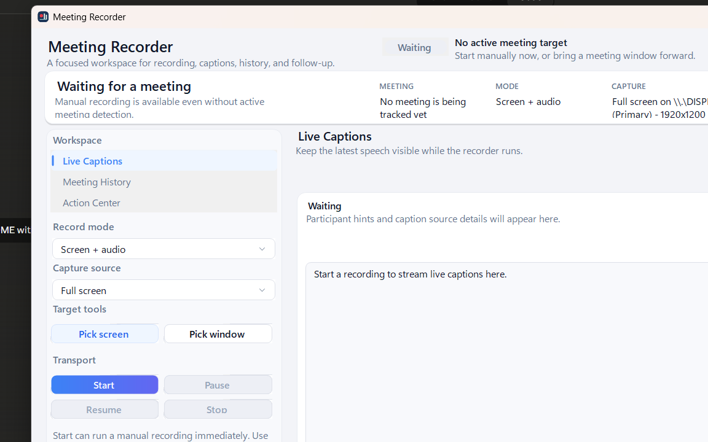
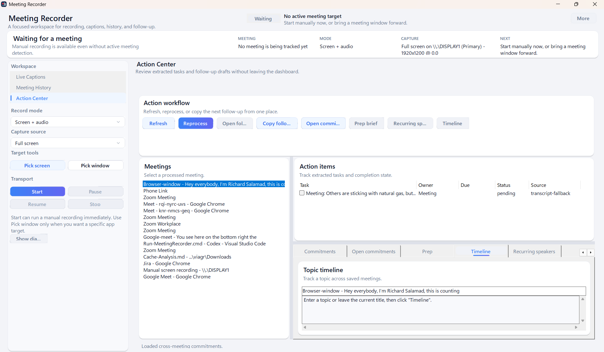
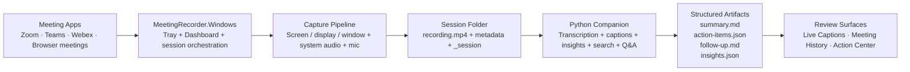

<a id="top"></a>

# Meeting Recorder

> Record meetings, stream captions, recover decisions, and turn raw calls into searchable memory.

<p align="center">
  
  
  
  
</p>

<p align="center">
  <a href="#why-it-exists">Why it exists</a> &middot;
  <a href="#latest-feature-updates">Latest feature updates</a> &middot;
  <a href="#what-you-get">What you get</a> &middot;
  <a href="#dashboard-surfaces">Dashboard surfaces</a> &middot;
  <a href="#intelligence-layer">Intelligence layer</a> &middot;
  <a href="#quick-start">Quick start</a> &middot;
  <a href="#session-layout">Session layout</a> &middot;
  <a href="#scripts">Scripts</a> &middot;
  <a href="#troubleshooting">Troubleshooting</a>
</p>

> [!IMPORTANT]
> **Status: beta, but real.** This repo already contains a working Windows recorder shell, screen/audio capture flow, live captions path, meeting history, action center, semantic retrieval, recurring speaker learning, and post-processing pipeline. Reliability and UX polish are still being hardened.

---

## Why It Exists

Most meeting tools solve only one slice of the problem:

- they record, but do not help you recover decisions later
- they caption, but do not remember anything after the call
- they summarize, but do not stay grounded in the evidence
- they create notes, but do not turn them into follow-through

**Meeting Recorder** is built as one Windows-first workspace that keeps the full chain together:

1. Capture the meeting
2. Keep live context visible while it runs
3. Process it into transcript, summary, actions, and insights
4. Search, ask, and revisit it later
5. Track commitments and repeated speakers across sessions

<p align="right"><a href="#top">back to top</a></p>

---

## Latest Feature Updates

### Recently added

- **Faster live captions path**
  Caption text now lands first, with speaker and tone enrichment applied after the fast pass.
- **Pop-out captions window**
  Live captions can stay visible in a separate window while the main dashboard stays focused on history or action review.
- **Recurring speaker memory**
  Processed meetings can now build lightweight cross-session speaker profiles that show up in insights and live caption labels.
- **Richer insights in the dashboard**
  History now surfaces agenda, sentiment, highlights, highlight clips, commitments, speakers, and recurring speaker matches.
- **Stronger Action Center**
  The app now includes cross-meeting commitments, prep briefs, topic timelines, and recurring-speaker visibility.
- **Cleaner output layout**
  New sessions keep the top-level meeting folder lighter, with richer derived signals bundled into `insights.json`.

### Live captions, now

- fast text-first updates
- retained caption history
- pop-out viewing
- best-effort live speaker labels
- tone hints in the UI
- atomic JSON writes with safer dashboard reads

<p align="right"><a href="#top">back to top</a></p>

---

## Product View

<p align="center">
  
</p>

<p align="center">
  
</p>

### The product in one sentence

**A Windows meeting cockpit for capture, live captions, searchable memory, and follow-through.**

### The current product stack

- **Windows shell**
  Tray app, dashboard, live captions view, Meeting History, Action Center
- **Capture path**
  Screen + audio or audio only, with session-oriented local artifacts
- **Companion pipeline**
  Transcription, summarization, action extraction, commitments, highlights, prep, timelines, search
- **Local-first storage**
  Sessions saved under `Documents\Meetings`
- **OpenAI-ready intelligence**
  Summaries, Q&A, semantic search, extraction, title generation, meeting classification

<p align="right"><a href="#top">back to top</a></p>

---

## What You Get

### Core workflow

| Area | Included now |
| --- | --- |
| Recording modes | `Screen + audio`, `Audio only` |
| Capture targets | Full screen, selected display, selected window |
| Session controls | Start, pause, resume, stop |
| Live view | Dashboard captions + pop-out captions window + retained caption history |
| History | Search completed meetings, inspect evidence, ask questions |
| Action workflow | Action items, follow-up, commitments, prep brief, topic timeline, recurring speakers |
| Storage | Local session folders in `Documents\Meetings` |
| Recovery | Mix-repair and migration scripts for older sessions |

### Intelligence outputs

| Output | Status |
| --- | --- |
| Transcript | Shipped |
| Summary | Shipped |
| Action items | Shipped |
| Follow-up draft | Shipped |
| Smart title | Shipped |
| Meeting type | Shipped |
| Sentiment analysis | Shipped |
| Agenda extraction | Shipped |
| Highlight moments | Shipped |
| Highlight clip export | Shipped for new processed sessions |
| Commitments | Shipped |
| Semantic search | Shipped |
| Recurring speaker identification | Shipped, first-pass |

### What is already visible in the Windows app

- **Meeting History**
  semantic search, preview, insights, ask-this-meeting
- **Insights**
  smart title, meeting type, sentiment, agenda, speakers, recurring speaker matches, highlights, highlight clips, commitments
- **Action Center**
  action items, follow-up draft, per-meeting commitments, cross-meeting commitments, prep brief, topic timeline, recurring speakers
- **Live Captions**
  rolling caption history, participant context, tone, best-effort live speaker labeling, and pop-out viewing

<p align="right"><a href="#top">back to top</a></p>

---

## Dashboard Surfaces

### 1. Live Captions

- Fast text-first updates while recording
- Full caption history while recording
- Pop-out captions window
- Participant context when available
- Real-time tone indicator
- Best-effort recurring speaker name shown in live captions when the model has a confident match

### 2. Meeting History

- Keyword or semantic search across saved meetings
- Evidence-backed preview
- Structured insights panel
- Ask a question against one saved meeting
- Open the session folder directly

### 3. Action Center

- Review extracted action items
- Inspect follow-up draft
- Track per-meeting commitments
- Review open commitments across meetings
- Generate a prep brief for the next meeting
- Build a topic timeline
- Surface recurring speakers already learned by the system

<p align="right"><a href="#top">back to top</a></p>

---

## Intelligence Layer

### What the AI layer does today

| Capability | What it does |
| --- | --- |
| Smart meeting titles | Generates a descriptive session title from the meeting content |
| Meeting type detection | Classifies sessions like standup, 1:1, planning, brainstorm |
| Sentiment / tone | Scores post-session sentiment and shows live tone hints |
| Highlights | Extracts important moments and exports clips for new sessions |
| Commitments | Tracks explicit promises and owners |
| Semantic search | Finds related meetings by meaning, not just exact text |
| Ask This Meeting | Answers against saved transcript and summary context |
| Prep brief | Summarizes what matters before the next related meeting |
| Topic timeline | Tracks how one topic evolves across sessions |
| Recurring speakers | Learns lightweight speaker profiles across processed meetings |
| Live speaker labels | Reuses learned speaker profiles during live captions when confidence is high enough |

### Recurring speaker identification

This repo now includes a first-pass recurring speaker memory:

- voice-like embeddings are computed from diarized audio segments
- speaker profiles are stored across sessions
- later meetings can reuse those learned identities
- live captions can show a learned speaker name when a confident match exists

> [!NOTE]
> This is a practical first pass, not a full production biometric speaker-verification stack. It works best after the app has already processed multiple meetings with usable speech from the same people.

### Current reality

#### Working well enough to use

- Windows-first dashboard flow
- local session folders
- semantic meeting recall
- grounded follow-up Q&A
- action extraction and follow-up generation
- recurring speaker learning across sessions
- real-time tone and live speaker hints

#### Still being hardened

- capture reliability across Zoom, Teams, Webex, and browsers
- low-latency true streaming captions
- stronger speaker matching on noisy audio
- multi-monitor edge cases
- overall UX polish and density in the dashboard

<p align="right"><a href="#top">back to top</a></p>

---

## Support Snapshot

| Capability | Google Meet in Chrome/Edge | Teams desktop | Zoom desktop | Webex desktop |
| --- | --- | --- | --- | --- |
| Detection | Beta | Beta | Beta | Beta |
| Audio-only recording | Better path today | Beta | Beta | Beta |
| Screen + audio recording | Beta | Beta | Beta | Beta |
| Live captions | Best path today | Partial | Partial | Partial |
| Named participants | Better when captions are exposed | Partial | Partial | Partial |
| Recurring speaker memory | Beta | Beta | Beta | Beta |
| History + Ask | Available after processing | Available after processing | Available after processing | Available after processing |

> [!TIP]
> **Beta** means the shipped path exists and is useful, but still needs more hardening.  
> **Partial** means the plumbing exists, but the source app still limits reliability.

<p align="right"><a href="#top">back to top</a></p>

---

## Architecture



<p align="right"><a href="#top">back to top</a></p>

---

## Quick Start

### Requirements

- Windows 11
- .NET 10 SDK
- Python 3.11+
- `ffmpeg.exe` on `PATH` or at `companion\bin\ffmpeg\ffmpeg.exe`

Recommended:

- a local `.venv`
- `OPENAI_API_KEY`
- `faster-whisper`

### Configuration model

- [`meeting-recorder.config.json`](C:/Users/viagr/Documents/Codex/ai-meeting-cockpit/meeting-recorder.config.json)
  Shared runtime behavior for the Windows app and the companion pipeline
- [`.env.example`](C:/Users/viagr/Documents/Codex/ai-meeting-cockpit/.env.example)
  Secrets and machine-specific overrides only

### 1. Create the Python environment

```powershell
python -m venv .venv
.\.venv\Scripts\Activate.ps1
pip install -r .\companion\requirements.txt
```

### 2. Create your local `.env`

```powershell
Copy-Item .env.example .env
```

Set at least:

```env
OPENAI_API_KEY=your_key_here
MEETING_COMPANION_SUMMARY_PROVIDER=openai
OPENAI_MODEL=gpt-5-mini
```

> [!WARNING]
> Never commit `.env`.

### 3. Build

```powershell
.\scripts\build_windows_shell.ps1
```

### 4. Run

```powershell
.\scripts\start_windows_recorder_fast.ps1
```

Rebuild and relaunch:

```powershell
.\scripts\start_windows_recorder_fast.ps1 -Rebuild
```

<p align="right"><a href="#top">back to top</a></p>

---

## In-App Flow

1. Launch the recorder dashboard
2. Choose `Screen + audio` or `Audio only`
3. Choose full screen, a display, or a window
4. Start the session
5. Watch live captions in the main dashboard or pop-out window
6. Stop when finished
7. Review the meeting from History or Action Center

<p align="right"><a href="#top">back to top</a></p>

---

## Session Layout

Sessions are stored under:

```text
Documents\Meetings\YYYY-MM-DD\<session-folder>
```

### Top-level outputs

```text
metadata.json
recording.mp4
transcript.txt
summary.md
action-items.json
follow-up.md
insights.json
```

### `insights.json` bundles

- smart title
- meeting type
- sentiment
- agenda
- highlights
- highlight clips
- commitments
- speaker identity summary

<details>
<summary><strong>Internal runtime artifacts</strong></summary>

Internal files live under:

```text
<session-folder>\_session
```

Typical files:

```text
capture.json
app.log
processing.log
live-captions-worker.log
system-audio.wav
mic.wav
mixed-audio.wav
transcript.json
speaker-diarization.json
speaker-identities.json
live-captions.json
live-captions.txt
native-captions.json
participants.json
highlight-clips\
```

</details>

<p align="right"><a href="#top">back to top</a></p>

---

## Scripts

| Script | Purpose |
| --- | --- |
| [build_windows_shell.ps1](C:/Users/viagr/Documents/Codex/ai-meeting-cockpit/scripts/build_windows_shell.ps1) | Build the Windows projects safely |
| [start_windows_recorder_fast.ps1](C:/Users/viagr/Documents/Codex/ai-meeting-cockpit/scripts/start_windows_recorder_fast.ps1) | Fast launch or rebuild-and-launch |
| [process_latest_meeting.ps1](C:/Users/viagr/Documents/Codex/ai-meeting-cockpit/scripts/process_latest_meeting.ps1) | Re-run processing for the newest meeting |
| [repair_failed_audio_mix.ps1](C:/Users/viagr/Documents/Codex/ai-meeting-cockpit/scripts/repair_failed_audio_mix.ps1) | Repair old sessions where the final mix dropped mic audio |
| [migrate_legacy_session_insights.ps1](C:/Users/viagr/Documents/Codex/ai-meeting-cockpit/scripts/migrate_legacy_session_insights.ps1) | Backfill older meetings into the consolidated `insights.json` layout |

### Useful companion CLI commands

```powershell
python -m companion.meeting_companion semantic-search --query "pricing change"
python -m companion.meeting_companion open-commitments
python -m companion.meeting_companion meeting-prep --title "Weekly product sync"
python -m companion.meeting_companion topic-timeline --query "rollout"
```

<p align="right"><a href="#top">back to top</a></p>

---

## Logs

### App-level logs

- `Documents\Meetings\logs\python-companion.log`
- `Documents\Meetings\logs\dotnet-recorder.log`
- `Documents\Meetings\logs\dotnet-startup-trace.log`
- `Documents\Meetings\logs\dotnet-startup-error.log`

### Per-meeting logs

- `<session-folder>\_session\app.log`
- `<session-folder>\_session\processing.log`
- `<session-folder>\_session\live-captions-worker.log`

> [!NOTE]
> If `Documents\Meetings` is not writable, logs fall back under repo-local `meetings-data\logs`.

<p align="right"><a href="#top">back to top</a></p>

---

## Troubleshooting

<details>
<summary><strong>The dashboard does not appear</strong></summary>

- run `.\scripts\start_windows_recorder_fast.ps1 -Rebuild`
- check `Documents\Meetings\logs\dotnet-startup-error.log`
- check `Documents\Meetings\logs\dotnet-startup-trace.log`

</details>

<details>
<summary><strong>My voice is missing from the final video</strong></summary>

- check `[meeting]\_session\mic.wav`
- run:

```powershell
.\scripts\repair_failed_audio_mix.ps1 -AllFailed
```

</details>

<details>
<summary><strong>Transcript or summary is missing</strong></summary>

- make sure the meeting actually captured audio
- install `faster-whisper`
- rerun:

```powershell
.\scripts\process_latest_meeting.ps1
```

</details>

<details>
<summary><strong>Live captions feel delayed</strong></summary>

- the current path is still near-realtime, not a true streaming ASR stack
- caption text is now written on a fast path first, with speaker/tone enrichment applied after that
- if tone or semantic features are rate-limited, the app should still keep showing caption text
- check `<session-folder>\_session\live-captions-worker.log` and `Documents\Meetings\logs\dotnet-recorder.log` for caption timing or file-read issues
- browser/native captions can improve responsiveness when available
- cleaner audio leads to better speaker and tone hints

</details>

<details>
<summary><strong>My old meetings still have extra JSON files</strong></summary>

Run:

```powershell
.\scripts\migrate_legacy_session_insights.ps1 -AllSessions -DeleteLegacyFiles
```

</details>

<p align="right"><a href="#top">back to top</a></p>

---

## Repository Layout

```text
ai-meeting-cockpit/
|-- windows-shell/                # .NET shell, capture orchestration, dashboard
|   |-- MeetingRecorder.Windows/
|   |-- MeetingRecorder.CaptureWorker/
|   `-- MeetingRecorder.Shared/
|-- companion/                    # Python pipeline, search, Q&A, extraction, captions
|   |-- meeting_companion/
|   |-- tests/
|   `-- bin/
|-- browser-extension/            # Optional legacy helper path
|-- scripts/                      # Build, repair, migration, launch helpers
|-- docs/assets/
|-- meeting-recorder.config.json
|-- .env.example
`-- README.md
```

<p align="right"><a href="#top">back to top</a></p>

---

## Testing

Python:

```powershell
python -m unittest discover -s companion\tests -p "test_*.py"
```

Windows build:

```powershell
.\scripts\build_windows_shell.ps1
```

Browser extension adapter tests:

```powershell
node browser-extension\tests\adapters.test.js
```

<p align="right"><a href="#top">back to top</a></p>

---

## Near-Term Priorities

- [ ] Keep hardening capture reliability across apps and monitor setups
- [ ] Push live captions toward a true streaming path
- [ ] Improve speaker matching confidence on noisier meetings
- [ ] Keep grounding `Ask This Meeting` answers more tightly in transcript evidence
- [ ] Continue polishing dashboard density and layout behavior

---

<p align="center">
  <sub>Built for Windows 11 with WinForms, Python, local session storage, and OpenAI-ready intelligence.</sub><br />
  <sub>Meeting Recorder is a Windows-first meeting cockpit, not just a recorder.</sub>
</p>
